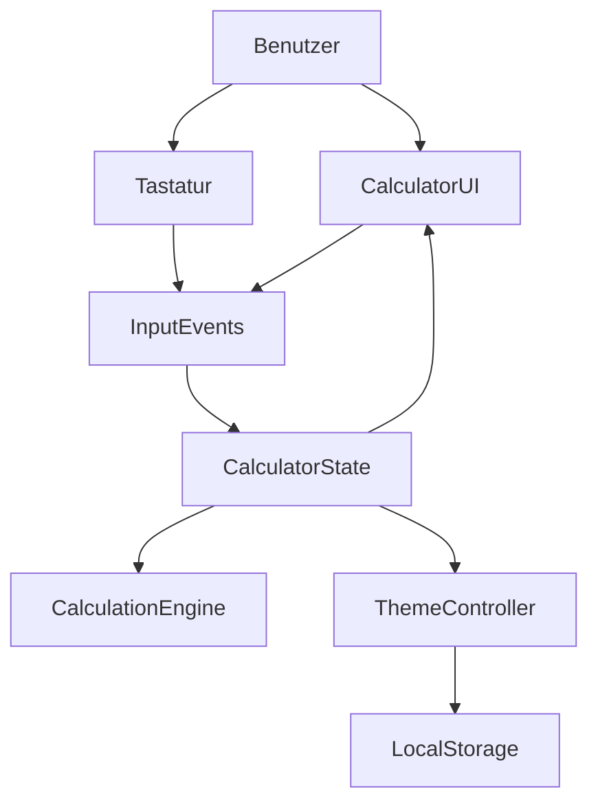

# Technisches Konzept: Browser-Taschenrechner (aktualisiert)

## Ziel

Ein einsteigerfreundlicher Taschenrechner, der komplett im Browser laeuft und per Maus sowie Tastatur bedient werden kann.

## Zielgruppe und Rahmen

- Fuer Einsteiger mit wenig Programmiererfahrung
- Kein Backend noetig (reines Frontend)
- Umsetzung als einzelne Web-Seite mit getrennten Dateien fuer Struktur, Design und Logik

## Technischer Stack

- **HTML** (`index.html`): UI-Struktur und Buttons
- **CSS** (`style.css`): Layout, responsive Darstellung, Light/Dark-Theme
- **JavaScript** (`script.js`): Zustandsverwaltung, Rechenlogik, Event-Handling

## Projektstruktur

- `index.html`
- `style.css`
- `script.js`
- `TECHNISCHES_KONZEPT.md`

## Architektur

- **UI-Schicht**: Display, Tastenfeld, Theme-Button
- **Logik-Schicht**: Zustand (`currentInput`, `previousInput`, `operator`, `shouldResetDisplay`)
- **Event-Schicht**: Maus- und Tastatur-Events steuern die Logik

## Funktionsumfang V1 (umgesetzt)

- Zahlen `0-9`
- Operatoren `+`, `-`, `*`, `/`
- Berechnen mit `=`
- Komplett loeschen mit `C`
- Dezimalpunkt `.`
- Fehlerbehandlung bei Division durch `0` (`Fehler`)

## Erweiterte Funktionen (zusatzlich umgesetzt)

### 1) Vollstaendige Eingabe im Display

- Bei `1 + 1` bleibt `1+1` im Display sichtbar
- Erst bei `=` wird das Ergebnis angezeigt

### 2) Backspace-Funktion (`⌫`)

- Loescht die letzte Eingabe schrittweise
- Funktioniert fuer:
  - erste Zahl
  - Operator
  - zweite Zahl
- Bei Fehlerzustand wird auf Startzustand zurueckgesetzt

### 3) Tastatursteuerung

- **Zahlen**: `0-9`
- **Operatoren**: `+`, `-`, `*`, `/`
- **Dezimalpunkt**: `.`
- **Berechnen**: `Enter` und `=`
- **Backspace**: `Backspace`
- **Komplett loeschen**: `Escape`

### 4) Hell-/Dunkelmodus

- Fester Umschalt-Button oben links im Browserfenster
- Wechsel zwischen Light und Dark Theme
- Auswahl wird in `localStorage` gespeichert und beim Neuladen wiederhergestellt

## Zustandsmodell

Im JavaScript wird ein klarer Zustand gehalten:

- `currentInput`: aktuell bearbeitete Zahl
- `previousInput`: vorherige Zahl fuer die Berechnung
- `operator`: gewaehlter Operator
- `shouldResetDisplay`: steuert, wann eine neue Zahl begonnen wird

Dieses Modell sorgt fuer nachvollziehbare Eingabefluesse und reduziert typische Logikfehler.

## Interaktionslogik (vereinfacht)

1. Zahl eingeben -> an aktuelle Zahl anhaengen
2. Operator waehlen -> erste Zahl und Operator merken
3. Zweite Zahl eingeben -> Ausdruck bleibt sichtbar (z. B. `12+34`)
4. `=` -> Ergebnis berechnen und anzeigen
5. `C` oder `Escape` -> alles zuruecksetzen
6. `Backspace` -> letzte Eingabe entfernen

## Fehler- und Randfallbehandlung

- Division durch `0` -> `Fehler`
- Mehrfacher Dezimalpunkt in einer Zahl wird verhindert
- Mehrfache Operator-Klicks: letzter Operator gilt
- Leere oder unvollstaendige Berechnungen mit `=` werden ignoriert

## UI-Konzept

- Rechner mittig platziert
- Display oben, Tasten in einem 4-spaltigen Grid
- Gute Lesbarkeit durch grosse Tasten und klaren Kontrast
- Responsive Darstellung fuer kleinere Bildschirme
- Zusaetzlicher Theme-Button oben links

## Qualitaetskriterien (Definition of Done)

- Alle Funktionen per Maus bedienbar
- Alle Kernfunktionen auch per Tastatur bedienbar
- Ausdruck bleibt bis zur Berechnung sichtbar
- Dark/Light Umschalten funktioniert inkl. Speicherung
- Keine Linter-Fehler in den Projektdateien

## Moegliche naechste Ausbaustufe (V2)

- Prozentfunktion `%`
- Vorzeichenwechsel `+/-`
- Verlauf/Historie letzter Rechnungen
- Visuelles Highlight der gedrueckten Taste bei Tastatureingabe
